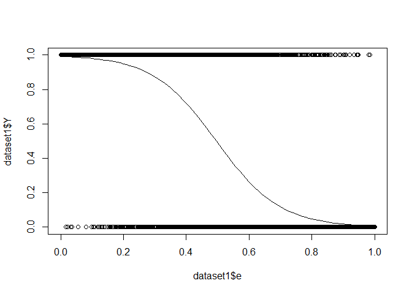

Background
----------

In this post I'll solve [exercise 1](https://github.com/DeveauP/ML_quizz/tree/master/1_FeatureExtraction), with R,
as I would do for a Kaggle.

<!--more-->

I started the [ML_quizz](https://github.com/DeveauP/ML_quizz/) repository to help with intern selections in a machine 
learning team (outside of academia). Some answers are available already inside the repository, but I wanted something much
more detailed and that could serve as a guide whatever your background in R/machine learning.

Data exploration
----------------

First we load the data:

``` r
dataset1<-read.table("dataset1.tsv",sep ="\t",header = TRUE)
```

Usually, it is a good thing to have a look at the data.

``` r
summary(dataset1)
```

|     |        a       |         b        |        c        |         d        |         e         |        f       |       g       |       h       |        Y       |
|-----|:--------------:|:----------------:|:---------------:|:----------------:|:-----------------:|:--------------:|:-------------:|:-------------:|:--------------:|
|     |  Min. : 1.000  |  Min. :-3.54588  |  Min. :-5.9946  |  Min. :-8.25827  |  Min. :0.0000653  |  Min. : 0.000  |  Min. :0.000  |  Min. : 0.00  |  Min. :0.0000  |
|     | 1st Qu.: 3.000 | 1st Qu.:-0.70473 | 1st Qu.:-0.3366 | 1st Qu.:-1.37090 | 1st Qu.:0.2528918 | 1st Qu.: 3.000 | 1st Qu.:1.000 | 1st Qu.: 7.00 | 1st Qu.:0.0000 |
|     | Median : 5.000 | Median :-0.02551 | Median : 0.9860 | Median : 0.02054 | Median :0.4945676 | Median : 5.000 | Median :1.000 | Median :11.00 | Median :1.0000 |
|     |  Mean : 5.509  |  Mean :-0.01800  |  Mean : 1.0013  |  Mean :-0.01200  |  Mean :0.4975494  |  Mean : 5.029  |  Mean :1.499  |  Mean :11.67  |  Mean :0.5001  |
|     | 3rd Qu.: 8.000 | 3rd Qu.: 0.65778 | 3rd Qu.: 2.3738 | 3rd Qu.: 1.32180 | 3rd Qu.:0.7433941 | 3rd Qu.: 6.000 | 3rd Qu.:2.000 | 3rd Qu.:15.00 | 3rd Qu.:1.0000 |
|     |  Max. :10.000  |  Max. : 4.32282  |  Max. : 8.9656  |  Max. : 6.99655  |  Max. :0.9999414  |  Max. :15.000  |  Max. :5.000  |  Max. :55.00  |  Max. :1.0000  |

Here we see that all the data is numeric (no categorical variable), and that Y seem to have only two values 0 or 1. We confirm this with:

``` r
unique(dataset1$Y)
```

    ## [1] 1 0

When you have to predict a categorical variable or a state, a good place to start is logistic regression.

Sample split
------------

To make sure that we are not overfitting the data, we need to divide the data into a training set and a testing set. Some functions exist in `caret` or `scikit-learn` in python to do this. But for the sake of the explanation, I will do this manually. I will sample 70% of the dataset for training, and will test on the remaining 30%.

``` r
SplitTrain<-sample(x = 1:nrow(dataset1),size = round(nrow(dataset1)*0.7),replace = FALSE)
train<-dataset1[SplitTrain,]
test<-dataset1[-SplitTrain,]
```

Then I will train the logistic on the train dataset, on all columns:

``` r
logistic<-glm(formula = Y ~ ., family = "binomial",data = train)
summary(logistic)
```

    ## 
    ## Call:
    ## glm(formula = Y ~ ., family = "binomial", data = train)
    ## 
    ## Deviance Residuals: 
    ##     Min       1Q   Median       3Q      Max  
    ## -3.0726  -0.4260  -0.1146   0.4397   3.1436  
    ## 
    ## Coefficients:
    ##               Estimate Std. Error z value Pr(>|z|)    
    ## (Intercept)  4.8079743  0.1844675  26.064   <2e-16 ***
    ## a           -0.0094818  0.0129360  -0.733    0.464    
    ## b           -0.0112601  0.0372402  -0.302    0.762    
    ## c            0.0062097  0.0190168   0.327    0.744    
    ## d            0.0006007  0.0186309   0.032    0.974    
    ## e           -9.8899338  0.2239260 -44.166   <2e-16 ***
    ## f            0.0086843  0.0167108   0.520    0.603    
    ## g            0.0402272  0.0360426   1.116    0.264    
    ## h            0.0030245  0.0060071   0.503    0.615    
    ## ---
    ## Signif. codes:  0 '***' 0.001 '**' 0.01 '*' 0.05 '.' 0.1 ' ' 1
    ## 
    ## (Dispersion parameter for binomial family taken to be 1)
    ## 
    ##     Null deviance: 9704.0  on 6999  degrees of freedom
    ## Residual deviance: 4598.2  on 6991  degrees of freedom
    ## AIC: 4616.2
    ## 
    ## Number of Fisher Scoring iterations: 6

We can already see that only column "e" seems to be important for our model. We can assess our model with:

``` r
prediction<-predict(logistic,test[,-ncol(test)],type="resp")
correct<- sum(as.integer(prediction >0.5) == test$Y)/length(prediction)
```

Notice that prediction gives the probability of Y = 1, to transform this into prediction, you have to take a threshold (here 0.5) to say if it belongs to your class or not. The fraction correct guesses in our case was 0.87%.

The glm summary warned us that some variables may not be relevant. We'll see what happens when we train without the variables that are not relevant:

``` r
logistic2<-glm(formula = Y ~ e, family = "binomial",data = train)
summary(logistic2)
```

    ## 
    ## Call:
    ## glm(formula = Y ~ e, family = "binomial", data = train)
    ## 
    ## Deviance Residuals: 
    ##     Min       1Q   Median       3Q      Max  
    ## -3.0825  -0.4266  -0.1171   0.4394   3.1102  
    ## 
    ## Coefficients:
    ##             Estimate Std. Error z value Pr(>|z|)    
    ## (Intercept)   4.9012     0.1169   41.92   <2e-16 ***
    ## e            -9.8873     0.2238  -44.18   <2e-16 ***
    ## ---
    ## Signif. codes:  0 '***' 0.001 '**' 0.01 '*' 0.05 '.' 0.1 ' ' 1
    ## 
    ## (Dispersion parameter for binomial family taken to be 1)
    ## 
    ##     Null deviance: 9704.0  on 6999  degrees of freedom
    ## Residual deviance: 4600.8  on 6998  degrees of freedom
    ## AIC: 4604.8
    ## 
    ## Number of Fisher Scoring iterations: 6

``` r
prediction2<-predict(logistic2,test[,-ncol(test)],type="resp")
correct2<- sum(as.integer(prediction2 >0.5) == test$Y)/length(prediction2)
```

We now have 0.8717% correct guesses... so our model improved marginally, but we only trained on a single variable! We could also play with the threshold to improve our predictor. \* To answer question 1 : only column e seems to play a role in the prediction.* * Answer 2:\* Overfitting is when the model is too close to the training data (learning on the noise for example).

Answering question 3 is now pretty straightforward, construct a data frame with colomn name e, and

``` r
predict(logistic2,data.frame(e = c(0.6,0.1)),type = "resp")
```

    ##         1         2 
    ## 0.2628562 0.9804012

Bonus
=====

This is what our regression looks like 
